# SmartFarm REST API – HW3 (CSCI-4930/5360)

### Step 1 – Project Setup

This project simulates an IoT SmartFarm system using Node.js and Express.

#### Environment Setup

1. Verified Node.js v18+ and npm installed
   ```bash
   node -v
   npm -v
   ```
2. Choose and Open a Working Directory

Opened VS Code, navigated to Documents, and opened a new integrated terminal.

3. Create Project Folder

Created a new directory for the SmartFarm API.

mkdir HW3-SmartFarm
cd HW3-SmartFarm

Confirmed path with:

cd # (Windows)

4. Initialize npm Project

Initialized npm to create a package.json file with default values.

npm init -y

Created package.json with default metadata.

5. Install Dependencies

Installed Express (for backend framework) and Joi (for input validation).

npm install express joi

Generated:

node_modules/ directory

package-lock.json file

6. Create Main Server File

Created an entry point for the application.

type nul > index.js # Windows

7. Run and Test the Server

Started the Express server to confirm setup.

node index.js

Expected Terminal Output:

Listening on 3000...

Visited http://localhost:3000
→ blank page (expected).

Console logs will appear once routes are added in later steps.

---

## Step 2 – Define Object Model (10 pts)

### Goal

Represent SmartFarm data using **in-memory arrays** to simulate a simple database for `sensors` and their corresponding `readings`.

---

### Implementation Summary

- Created two in-memory arrays:
  - **sensors[]** → holds objects describing each IoT sensor (with `id`, `location`, `type`, and `status`).
  - **readings[]** → holds measurement data (linked to a sensor using `sensorId`).
- Added a test route to retrieve and view all sensors to confirm that the data model was correctly defined.
- Verified that Express returned the data in JSON format.

---

### Testing

Tested the route using a browser and Postman.

| Test Case            | Method | URL            | Expected Response              |
| -------------------- | :----: | :------------- | :----------------------------- |
| Retrieve all sensors | `GET`  | `/api/sensors` | JSON array showing sensor data |

**Result:**  
Displayed all sensors successfully in the browser and Postman.

---

### Evidence (Optional Screenshot)

Include a screenshot of the `/api/sensors` endpoint output from your browser or Postman.


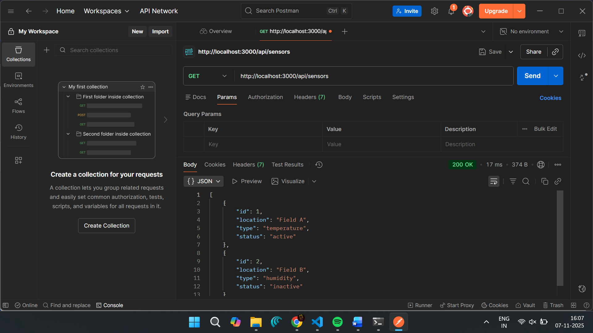

---

## Step 3 – CRUD Routes for Sensors (20 pts)

### Goal

Implement RESTful API routes to manage **sensor data** through Create, Read, Update, and Delete operations using standard HTTP methods.

---

### Implementation Summary

- Added complete CRUD routes for the `/api/sensors` endpoint:
  - **GET** → Retrieve all sensors or a specific sensor by ID
  - **POST** → Create a new sensor record
  - **PUT** → Update an existing sensor
  - **DELETE** → Remove a sensor by ID
- Used appropriate HTTP status codes (`200`, `201`, `400`, `404`) to indicate success or error.
- Ensured meaningful responses and basic validation for required fields (`location`, `type`, `status`).

---

### Testing with Postman

Each route was tested using **Postman** while the server was running.

| Test Case       |  Method  | URL              | Body (JSON)                                                         | Expected Result                                    |
| --------------- | :------: | :--------------- | :------------------------------------------------------------------ | :------------------------------------------------- |
| Get all sensors |  `GET`   | `/api/sensors`   | —                                                                   | Returns list of sensors                            |
| Get by ID       |  `GET`   | `/api/sensors/1` | —                                                                   | Returns a single sensor object or 404 if not found |
| Create sensor   |  `POST`  | `/api/sensors`   | `{ "location": "Field C", "type": "moisture", "status": "active" }` | Creates a new sensor (201 Created)                 |
| Update sensor   |  `PUT`   | `/api/sensors/2` | `{ "location": "Field B", "type": "humidity", "status": "active" }` | Updates the specified sensor                       |
| Delete sensor   | `DELETE` | `/api/sensors/1` | —                                                                   | Removes the sensor and returns its details         |

---

### Postman Evidence

Include screenshots of each successful CRUD test.

`````markdown
**1️ GET All Sensors**  


**2 GET Sensor by ID**  
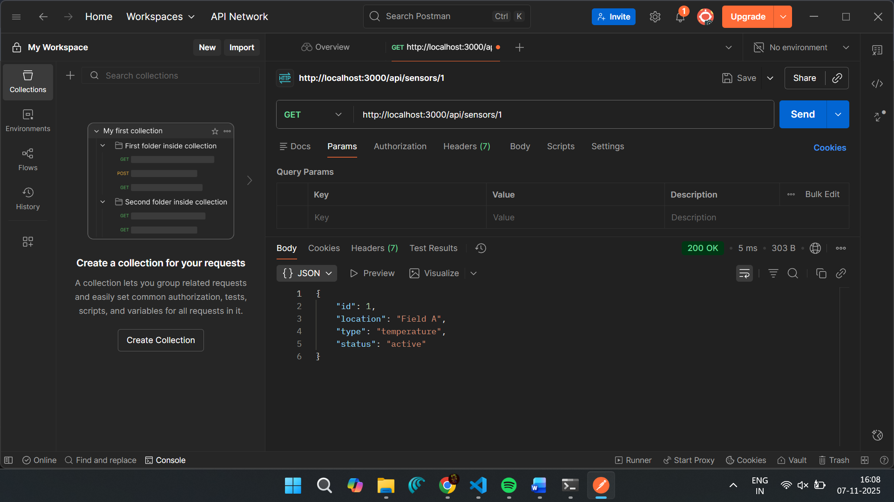

**3 POST Create Sensor**  


**4 PUT Update Sensor**  


**5 DELETE Remove Sensor**  
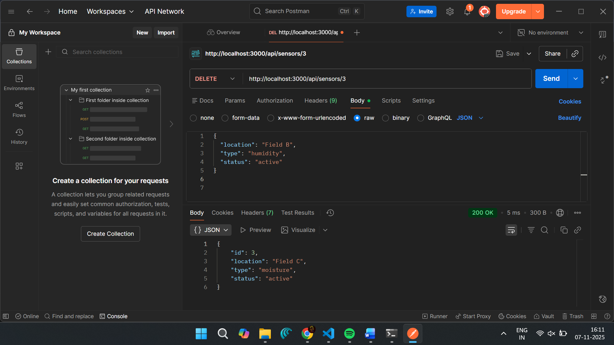

---

## Step 4 – Input Validation with Joi (15 pts)

### Goal

Integrate **Joi** to validate incoming sensor data in all `POST` and `PUT` routes.  
This ensures that every new or updated sensor record includes valid fields (`location`, `type`, and `status`) and prevents bad data from being stored.

---

### Implementation Summary

- Imported the Joi library into `index.js`.
- Defined a validation schema with required fields:
  - `location`: string, minimum 3 characters
  - `type`: must be one of `temperature`, `humidity`, or `moisture`
  - `status`: must be either `active` or `inactive`
- Applied this schema inside both `POST` and `PUT` routes.
- If validation fails, the server responds with **HTTP 400** and a descriptive error message (e.g., `"status" is required"`).

---

### Testing with Postman

All scenarios were tested using Postman.

| Test Case         | Method | URL              | Request Body                                                                | Expected Result                                                                |
| :---------------- | :----: | :--------------- | :-------------------------------------------------------------------------- | :----------------------------------------------------------------------------- |
| ✅ Valid POST     | `POST` | `/api/sensors`   | `{ "location": "Field D", "type": "temperature", "status": "active" }`      | `201 Created` + new sensor JSON                                                |
| ❌ Short location | `POST` | `/api/sensors`   | `{ "location": "A", "type": "humidity", "status": "active" }`               | `400 Bad Request` → `"location" length must be at least 3 characters long"`    |
| ❌ Invalid type   | `POST` | `/api/sensors`   | `{ "location": "Field X", "type": "pressure", "status": "active" }`         | `400 Bad Request` → `"type" must be one of [temperature, humidity, moisture]"` |
| ❌ Missing status | `POST` | `/api/sensors`   | `{ "location": "Field Y", "type": "humidity" }`                             | `400 Bad Request` → `"status" is required"`                                    |
| ✅ Valid PUT      | `PUT`  | `/api/sensors/2` | `{ "location": "Field B Updated", "type": "humidity", "status": "active" }` | Sensor updated successfully                                                    |
| ❌ Invalid PUT    | `PUT`  | `/api/sensors/2` | `{ "location": "X", "type": "invalidtype", "status": "running" }`           | `400 Bad Request` with Joi message                                             |

---

### Evidence (Postman Screenshots)

````markdown
**1️⃣ Valid POST Request – Successful Creation**  
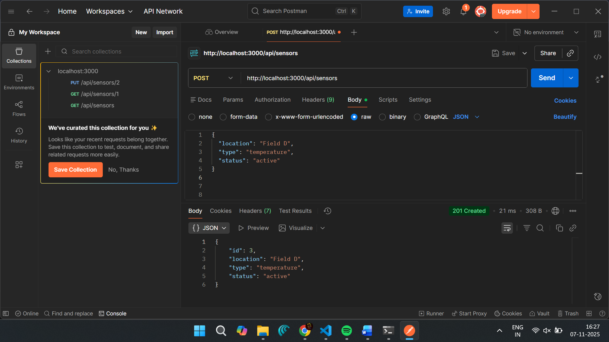

**2️⃣ Invalid POST – Short Location**  
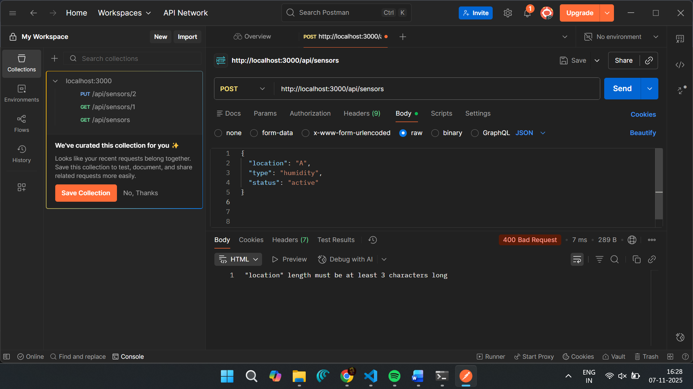

**3️⃣ Invalid POST – Wrong Type**  


**4️⃣ Invalid POST – Missing Status**  
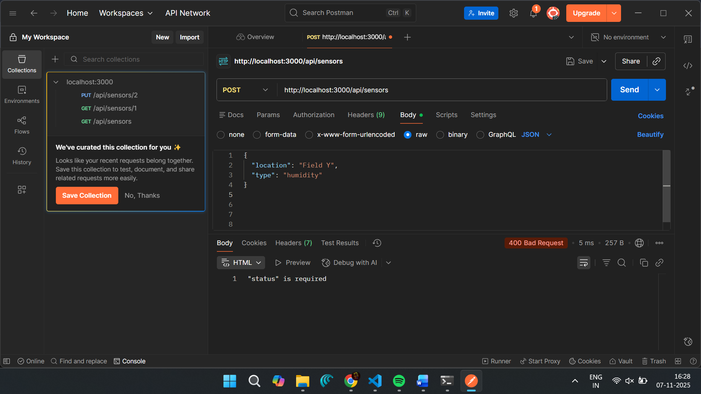

**5️⃣ Valid PUT Request – Successful Update**  
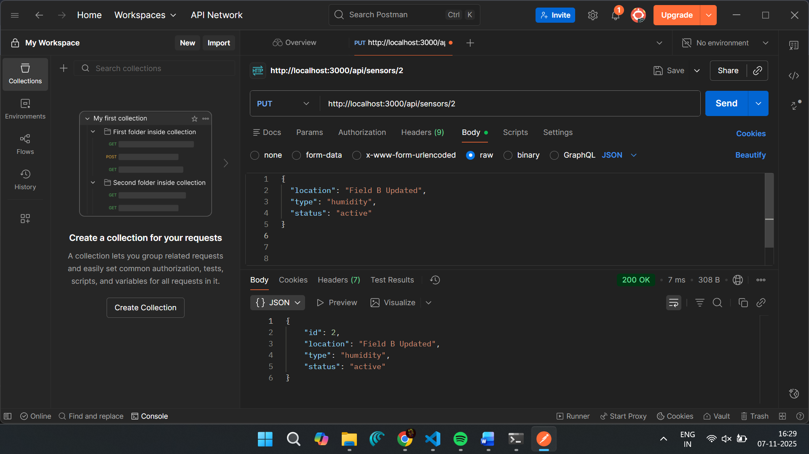

**6️⃣ Invalid PUT Request – Wrong Type/Status**  
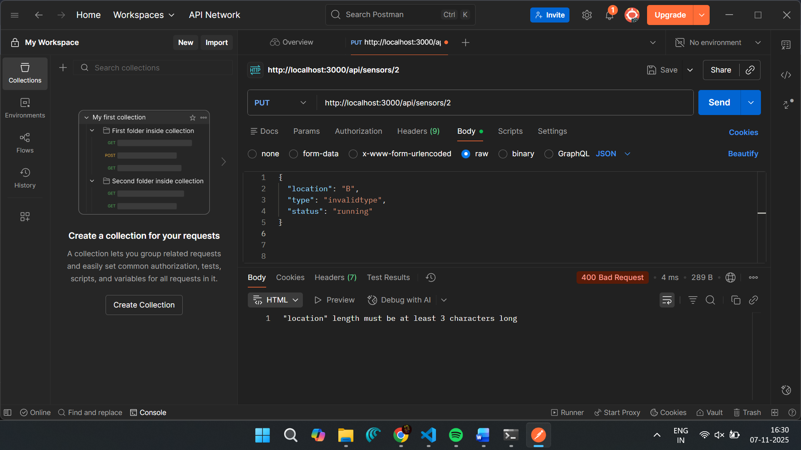

## Step 5 – Nested Routes for Readings (15 pts)

### Goal

Extend the SmartFarm API to support **nested routes** that connect sensors and their corresponding readings.  
This demonstrates a **one-to-many relationship**, where each sensor can have multiple readings.

### Implementation Summary

- Added a new endpoint group under `/api/sensors/:id/readings`.
- Implemented:
  - **GET** → Retrieve all readings for a specific sensor.
  - **POST** → Add a new reading for a specific sensor.
- Integrated validation to ensure:
  - The sensor ID exists before processing the request.
  - Both `timestamp` and `value` fields are required when adding new readings.
- Used proper HTTP status codes (`201`, `400`, `404`) for consistent API feedback.

---

### Testing with Postman

All routes were tested in Postman while the server was running (`node index.js`).

| Test Case                 | Method | URL                         | Request Body                                             | Expected Result                               |
| ------------------------- | :----: | :-------------------------- | :------------------------------------------------------- | :-------------------------------------------- |
| Get readings for sensor 1 | `GET`  | `/api/sensors/1/readings`   | —                                                        | Returns a list of readings linked to sensor 1 |
| Invalid sensor ID         | `GET`  | `/api/sensors/999/readings` | —                                                        | `404 Sensor with given ID not found`          |
| Add a new reading         | `POST` | `/api/sensors/1/readings`   | `{ "timestamp": "2025-11-07T09:30:00Z", "value": 25.6 }` | Adds new reading (`201 Created`)              |
| Missing field             | `POST` | `/api/sensors/1/readings`   | `{ "value": 22.8 }`                                      | `400 Both timestamp and value are required`   |

---

### Postman Evidence

```markdown
**1️⃣ GET all readings for sensor 1**  
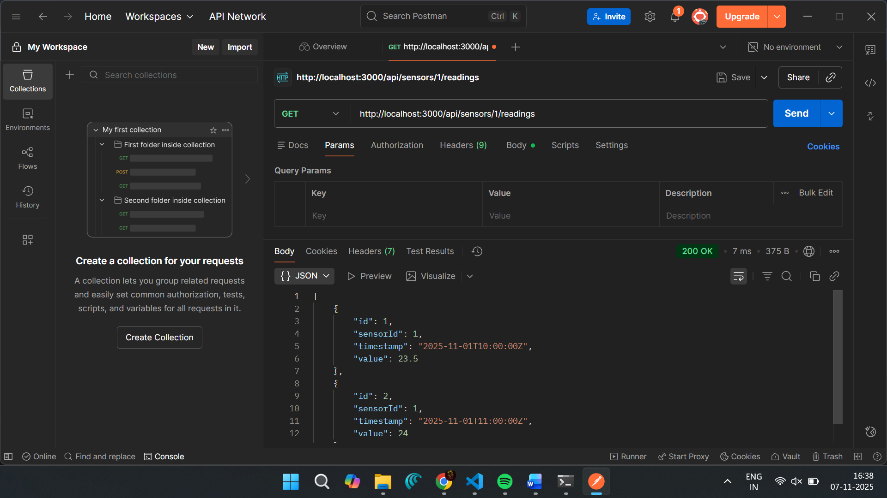

**2️⃣ POST new reading**  
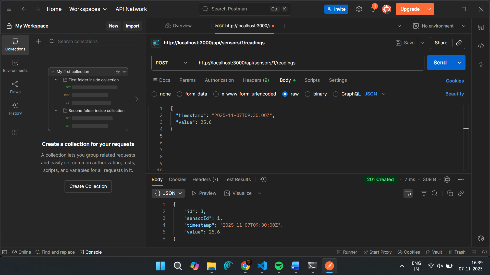

**3️⃣ GET after adding new reading**  


**4️⃣ Invalid POST (missing field)**  
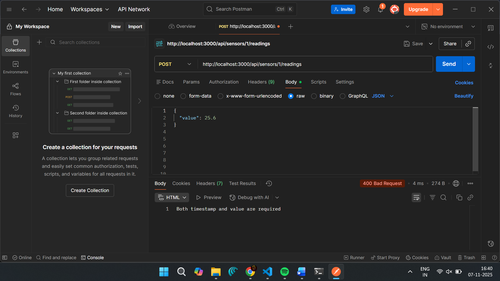
```
````
`````
``````

## Step 6 – Filtering via Query Parameters (10 pts)

### Goal

Implement query parameter–based filtering to allow users to retrieve specific subsets of readings.
This makes the API more flexible and realistic — clients can request only the data they need (for example, all temperature readings or readings within a numeric range).

---

### Implementation Summary

- Added a new route `/api/readings` that supports query parameters:
  - `type` → filter readings by the sensor’s type (e.g., temperature, humidity, moisture)
  - `minValue` → show readings with a value **greater than or equal** to this number
  - `maxValue` → show readings with a value **less than or equal** to this number
- Multiple filters can be applied simultaneously (e.g., type + range).
- Ensured numeric comparison uses `Number()` conversion for accurate filtering.
- Returned `404` or an empty array if filters match no records.

---

### Testing with Postman

All filtering combinations were tested while the server was running.

| Test Case          | Method | URL                                          | Expected Result                  |
| ------------------ | :----: | :------------------------------------------- | :------------------------------- |
| Get all readings   | `GET`  | `/api/readings`                              | Returns every reading record     |
| Filter by type     | `GET`  | `/api/readings?type=temperature`             | Only temperature sensor readings |
| Filter by minValue | `GET`  | `/api/readings?minValue=24`                  | Readings with `value ≥ 24`       |
| Filter by range    | `GET`  | `/api/readings?minValue=23&maxValue=25`      | Readings between 23 and 25       |
| Combine filters    | `GET`  | `/api/readings?type=temperature&minValue=24` | Only temperature readings ≥ 24   |
| Invalid type       | `GET`  | `/api/readings?type=invalidtype`             | Empty array or 404 message       |

---

### Postman Evidence

```markdown
**1️⃣ GET All Readings**


**2️⃣ Filter by Type (temperature)**


**3️⃣ Filter by Value Range (23 – 25)**
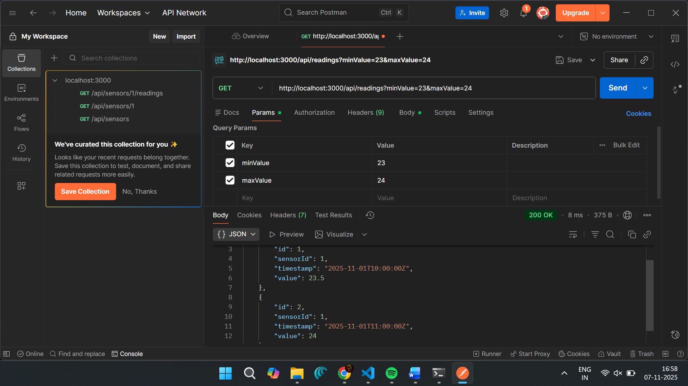

**4️⃣ Combined Filters (type + minValue)**
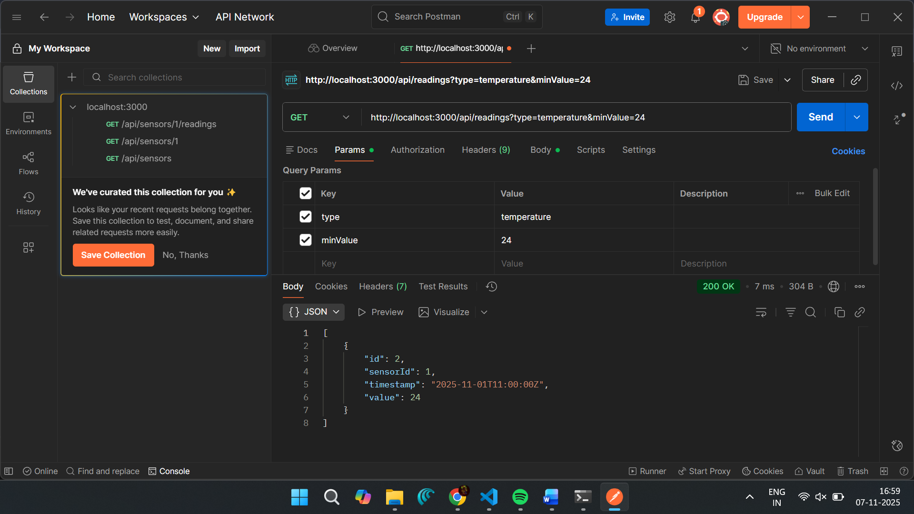

**5️⃣ Invalid Type Filter**
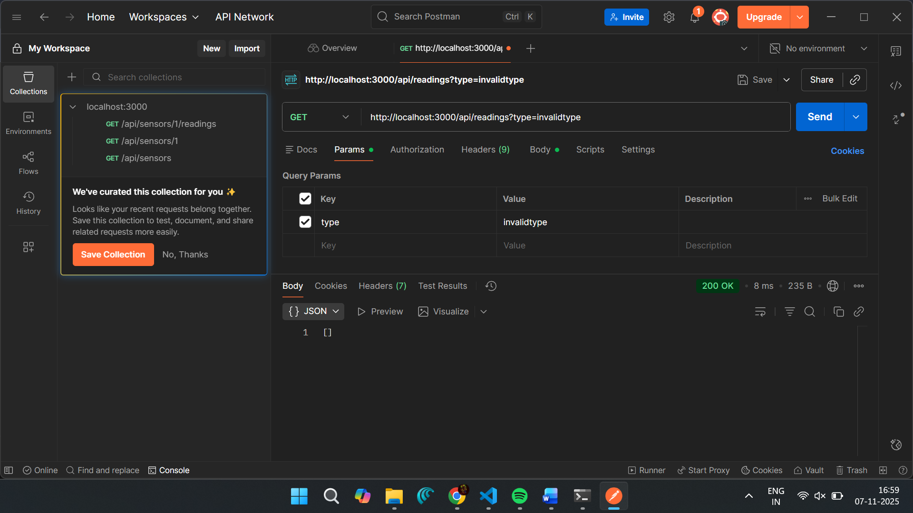
```

---

## Step 7 – Logging Middleware & Error Handling (10 pts)

### Goal

Add logging and centralized error handling to make the SmartFarm Express API more reliable, transparent, and production-ready.

---

### Implementation Summary

- Implemented **logging middleware** to record every request’s method, URL, status code, and duration.
- Enhanced logs with ISO timestamps for clarity and easier debugging.
- Added a **global error-handling middleware** that catches unexpected issues and returns a clean `500 Internal Server Error` message.
- Ensured invalid routes return `404` responses instead of breaking the server.

---

### Testing with Postman & Terminal

| Test Case            | Method | URL            | Expected Result                                         |
| -------------------- | :----: | :------------- | :------------------------------------------------------ |
| Normal request       | `GET`  | `/api/sensors` | Terminal logs request details with duration             |
| Invalid route        | `GET`  | `/api/invalid` | Returns `Cannot GET /api/invalid` (404)                 |
| Trigger manual error | `GET`  | `/api/error`   | Returns `Something went wrong on the server!` (500)     |
| Combined logging     |  Any   | All routes     | Shows timestamp, method, URL, status code, and duration |

---

### Evidence (Screenshots)

```markdown
**1️⃣ Terminal Logging Output**
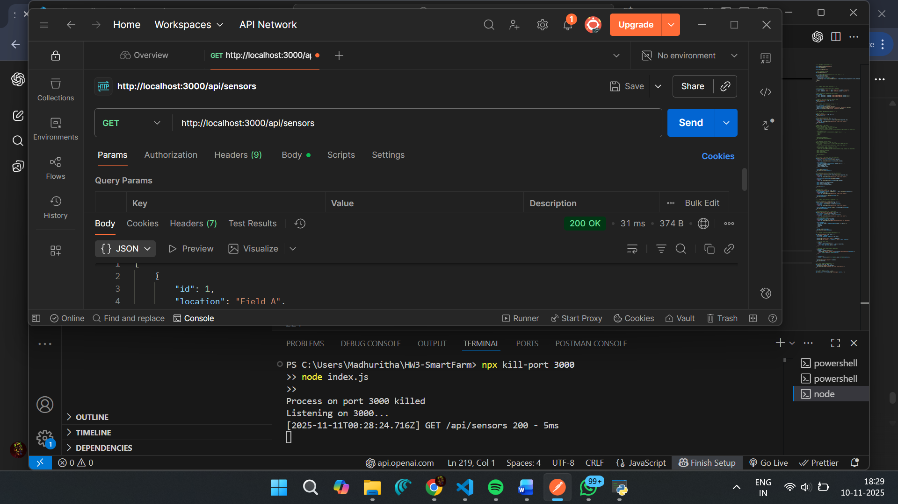

**2️⃣ Invalid Route (404 Test)**
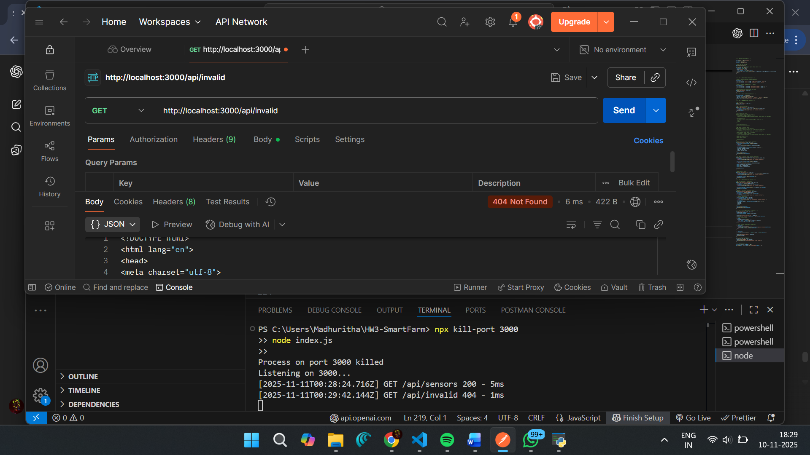

**3️⃣ Error Handling (500 Test)**
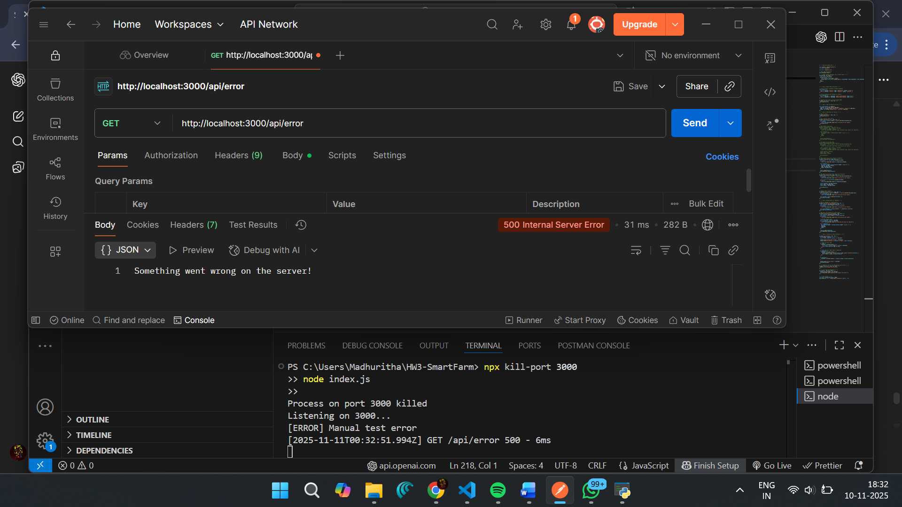

## Project Conclusion

The SmartFarm Express API project demonstrates the design of a fully functional RESTful backend for IoT-style sensor management.
It implements best practices such as:

- CRUD operations for data management
- Schema validation with Joi
- Nested routes for relational data
- Query-based filtering
- Middleware logging and centralized error handling

Through Postman testing and documentation, each feature was verified for correctness and performance.
This project provided hands-on experience in building scalable, maintainable, and testable Express APIs.
```

---

